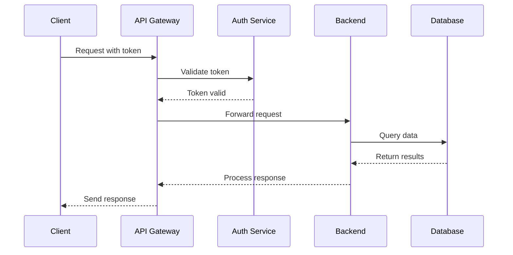
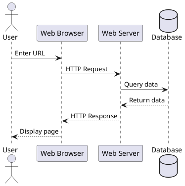

# Sequence & Activity Diagrams

Temporibus autem quibusdam et aut officiis debitis aut rerum necessitatibus saepe eveniet ut et voluptates repudiandae sint et molestiae non recusandae.

## Sequence Diagrams

Itaque earum rerum hic tenetur a sapiente delectus, ut aut reiciendis voluptatibus maiores alias consequatur aut perferendis doloribus asperiores repellat.

### Authentication Flow

```seqdiag
seqdiag {
  browser  -> webserver [label = "GET /login"];
  browser <-- webserver [label = "Login Page"];
  browser  -> webserver [label = "POST /auth"];
  webserver -> database [label = "SELECT user"];
  webserver <-- database [label = "User data"];
  webserver -> webserver [label = "Validate credentials"];
  browser <-- webserver [label = "Set session cookie"];
  browser  -> webserver [label = "GET /dashboard"];
  webserver -> database [label = "Fetch user data"];
  webserver <-- database;
  browser <-- webserver [label = "Dashboard HTML"];
}
```

### API Communication

Sed ut perspiciatis unde omnis iste natus error sit voluptatem accusantium doloremque laudantium.



## Activity Diagrams

Totam rem aperiam, eaque ipsa quae ab illo inventore veritatis et quasi architecto beatae vitae dicta sunt explicabo.

### Document Publishing Workflow

```actdiag
actdiag {
  write -> review -> approve -> publish;

  lane user {
     label = "User"
     write [label = "Write content"];
     review [label = "Submit for review"];
  }
  lane approver {
     label = "Approver"
     approve [label = "Approve content"];
  }
  lane system {
     label = "System"
     publish [label = "Publish to site"];
  }
}
```

### State Machine

Nemo enim ipsam voluptatem quia voluptas sit aspernatur aut odit aut fugit.

```nomnoml
[<start> start] -> [Idle]
[Idle] -> [Processing]
[Processing] -> [Success]
[Processing] -> [Error]
[Success] -> [Idle]
[Error] -> [Retry]
[Retry] -> [Processing]
[Retry] -> [Failed]
[Failed] -> [<end> end]
```

## PlantUML Sequence Example

Sed quia consequuntur magni dolores eos qui ratione voluptatem sequi nesciunt.



Neque porro quisquam est, qui dolorem ipsum quia dolor sit amet, consectetur, adipisci velit, sed quia non numquam eius modi tempora incidunt ut labore et dolore magnam aliquam quaerat voluptatem.
