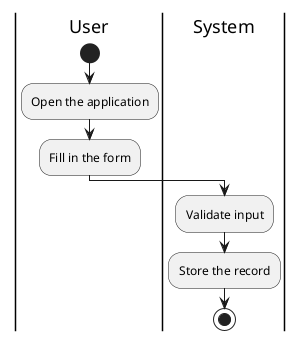
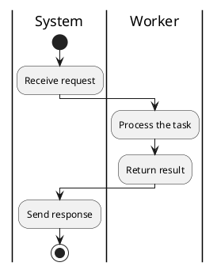

# Diagram After Code Snippet

Regression test: a fenced code block with attributes (e.g. `title`) preceding a diagram
must not prevent the diagram from being processed by the kroki plugin.

## Example Code

```python title="example/hello.py"
import sys


def greet(name: str) -> None:
    print(f"Hello, {name}!")


if __name__ == "__main__":
    greet(sys.argv[1] if len(sys.argv) > 1 else "world")
```

## First Activity Diagram

This diagram must be rendered by kroki with styles applied.



## Second Activity Diagram

This diagram should also be rendered identically.


