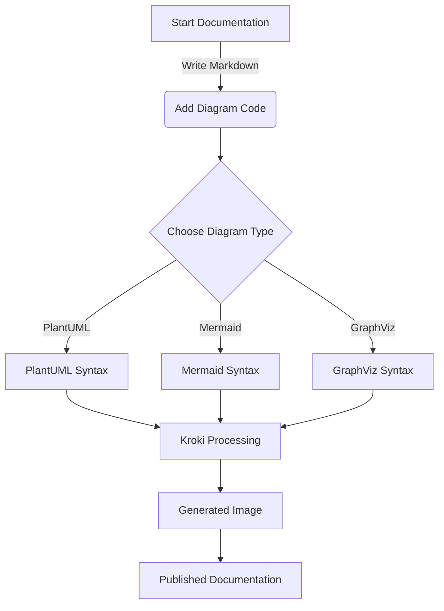
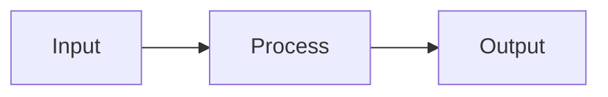
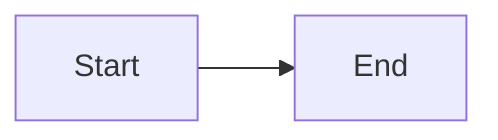

# Welcome to the Kroki Plugin Playground

Lorem ipsum dolor sit amet, consectetur adipiscing elit. Sed do eiusmod tempor incididunt ut labore et dolore magna aliqua. Ut enim ad minim veniam, quis nostrud exercitation ullamco laboris nisi ut aliquip ex ea commodo consequat.

## Overview

This playground demonstrates the capabilities of the mkdocs-kroki-plugin. Duis aute irure dolor in reprehenderit in voluptate velit esse cillum dolore eu fugiat nulla pariatur. Excepteur sint occaecat cupidatat non proident, sunt in culpa qui officia deserunt mollit anim id est laborum.

### Quick Example - BlockDiag

Sed ut perspiciatis unde omnis iste natus error sit voluptatem accusantium doloremque laudantium, totam rem aperiam, eaque ipsa quae ab illo inventore veritatis et quasi architecto beatae vitae dicta sunt explicabo.

```blockdiag
blockdiag {
  blockdiag -> generates -> "block-diagrams";
  blockdiag -> is -> "very easy!";

  blockdiag [color = "greenyellow"];
  "block-diagrams" [color = "pink"];
  "very easy!" [color = "orange"];
}
```

## Architecture Example

Nemo enim ipsam voluptatem quia voluptas sit aspernatur aut odit aut fugit, sed quia consequuntur magni dolores eos qui ratione voluptatem sequi nesciunt.

```c4plantuml
!include <C4/C4_Context>
!include <C4/C4_Container>

title System Context diagram for Kroki Plugin

Person(developer, "Developer", "Creates documentation with diagrams")
Person(reader, "Reader", "Consumes the documentation")

System_Boundary(docs, "Documentation System") {
    Container(mkdocs, "MkDocs", "Python", "Static site generator")
    Container(plugin, "Kroki Plugin", "Python", "Renders diagrams")
    ContainerDb(output, "Static Site", "HTML/CSS/JS", "Published documentation")
}

System_Ext(kroki, "Kroki Server", "Renders diagrams to images")

Rel(developer, mkdocs, "Writes markdown with")
BiRel(mkdocs, plugin, "Processes diagrams via")
BiRel(plugin, kroki, "Generates images from")
Rel(mkdocs, output, "Builds")
Rel(reader, output, "Reads")
```

## Process Flow

At vero eos et accusamus et iusto odio dignissimos ducimus qui blanditiis praesentium voluptatum deleniti atque corrupti quos dolores et quas molestias excepturi sint occaecati cupiditate non provident.



Similique sunt in culpa qui officia deserunt mollitia animi, id est laborum et dolorum fuga. Et harum quidem rerum facilis est et expedita distinctio.

## External Diagram Reference

You can also reference diagrams from external files for better organization:

```plantuml
@from_file:assets/system-overview.puml
```

Nam libero tempore, cum soluta nobis est eligendi optio cumque nihil impedit quo minus id quod maxime placeat facere possimus, omnis voluptas assumenda est, omnis dolor repellendus.

## Display Options

You can control the display size of diagrams using `display-width` and `display-height` options. These set inline CSS styles, so you can use any valid CSS value like `px`, `%`, `em`, etc.

### Default Size

Without display options, diagrams render at their native size:



### With Display Width (pixels)

Setting only `display-width` scales the diagram proportionally:


### With Percentage Width

Use percentage values for responsive sizing:

```blockdiag {display-width=50%}
blockdiag {
  A -> B -> C -> D;
  A [color = "greenyellow"];
  D [color = "pink"];
}
```

### With Both Width and Height

You can set both dimensions for precise control:

```blockdiag {display-width=400px display-height=150px}
blockdiag {
  A -> B -> C -> D;
  A [color = "greenyellow"];
  D [color = "pink"];
}
```

### Alignment

Use `display-align` to position diagrams. This sets `display: block` and appropriate margins.

#### Centered



#### Right-aligned


#### Left-aligned (default block behavior)


### Constrained Width Example

A complex diagram constrained to 500px width and centered:

```c4plantuml {display-width=500px display-align=center}
!include <C4/C4_Context>

Person(user, "User")
System(system, "System")
System_Ext(ext, "External")

Rel(user, system, "Uses")
Rel(system, ext, "Calls")
```
