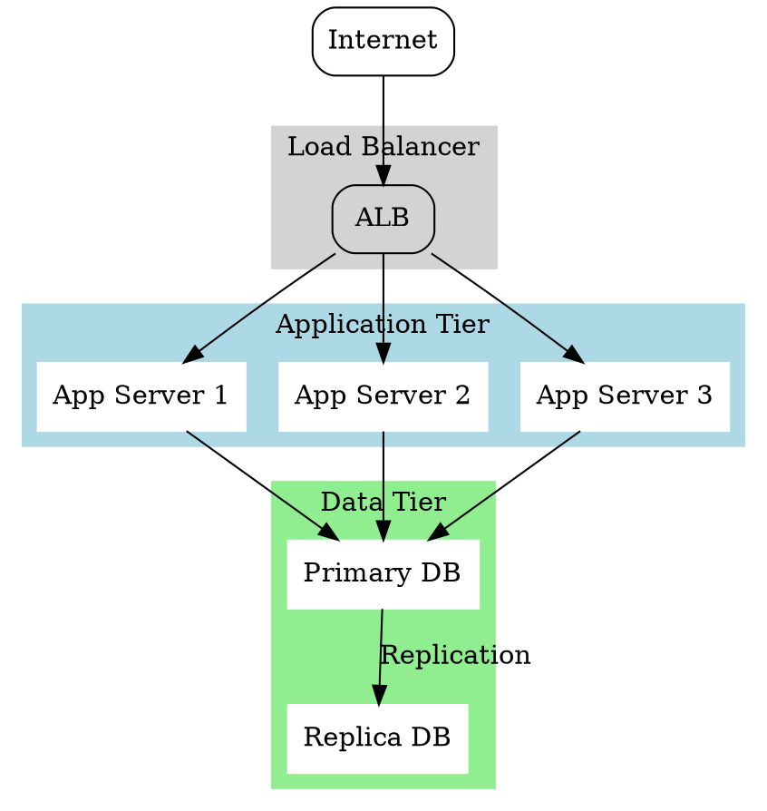

# Network & Infrastructure Diagrams

Ut enim ad minima veniam, quis nostrum exercitationem ullam corporis suscipit laboriosam, nisi ut aliquid ex ea commodi consequatur.

## Network Topology

Quis autem vel eum iure reprehenderit qui in ea voluptate velit esse quam nihil molestiae consequatur.

### DMZ and Internal Network

```nwdiag
nwdiag {
  network dmz {
    address = "210.x.x.x/24"

    web01 [address = "210.x.x.1"];
    web02 [address = "210.x.x.2"];
  }
  network internal {
    address = "172.x.x.x/24";

    web01 [address = "172.x.x.1"];
    web02 [address = "172.x.x.2"];
    db01;
    db02;
  }
}
```

## Packet Structure

Vel illum qui dolorem eum fugiat quo voluptas nulla pariatur? At vero eos et accusamus et iusto odio dignissimos.

### TCP Header

```packetdiag
packetdiag {
  colwidth = 32
  node_height = 72

  0-15: Source Port
  16-31: Destination Port
  32-63: Sequence Number
  64-95: Acknowledgment Number
  96-99: Data Offset
  100-105: Reserved
  106: URG [rotate = 270]
  107: ACK [rotate = 270]
  108: PSH [rotate = 270]
  109: RST [rotate = 270]
  110: SYN [rotate = 270]
  111: FIN [rotate = 270]
  112-127: Window
  128-143: Checksum
  144-159: Urgent Pointer
  160-191: (Options and Padding)
  192-223: data [colheight = 3]
}
```

## Cloud Architecture

Ducimus qui blanditiis praesentium voluptatum deleniti atque corrupti quos dolores et quas molestias excepturi sint occaecati cupiditate non provident.



## Infrastructure Overview

Similique sunt in culpa qui officia deserunt mollitia animi, id est laborum et dolorum fuga.

```d2
direction: right

users: Users {
  shape: person
  style.multiple: true
}

cdn: CDN {
  shape: cloud
}

lb: Load Balancer {
  shape: hexagon
}

app_tier: Application Tier {
  web1: Web Server 1 {
    shape: rectangle
  }
  web2: Web Server 2 {
    shape: rectangle
  }
  web3: Web Server 3 {
    shape: rectangle
  }
}

db_tier: Database Tier {
  primary: Primary DB {
    shape: cylinder
  }
  replica: Replica DB {
    shape: cylinder
  }
}

users -> cdn: HTTPS
cdn -> lb: Forward
lb -> app_tier.web1
lb -> app_tier.web2
lb -> app_tier.web3
app_tier.web1 -> db_tier.primary: Query
app_tier.web2 -> db_tier.primary: Query
app_tier.web3 -> db_tier.primary: Query
db_tier.primary -> db_tier.replica: Replicate
```

Et harum quidem rerum facilis est et expedita distinctio. Nam libero tempore, cum soluta nobis est eligendi optio cumque nihil impedit quo minus id quod maxime placeat facere possimus.
