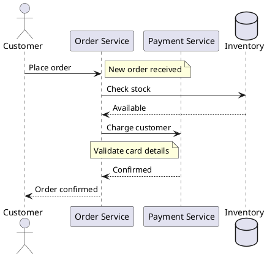
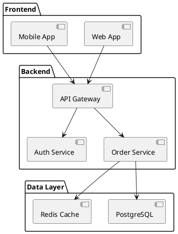
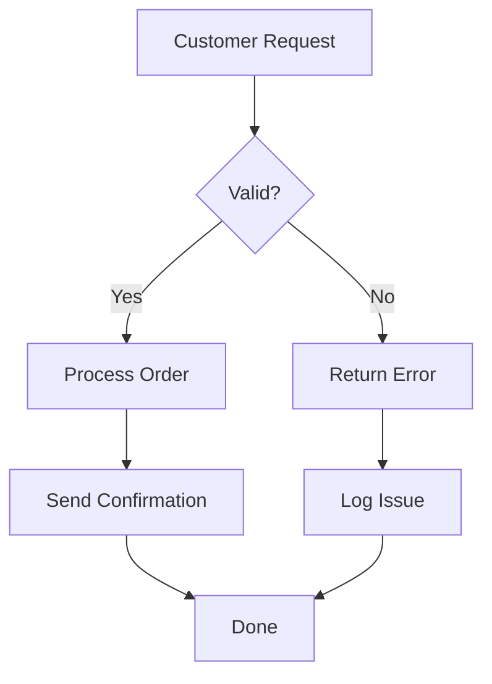
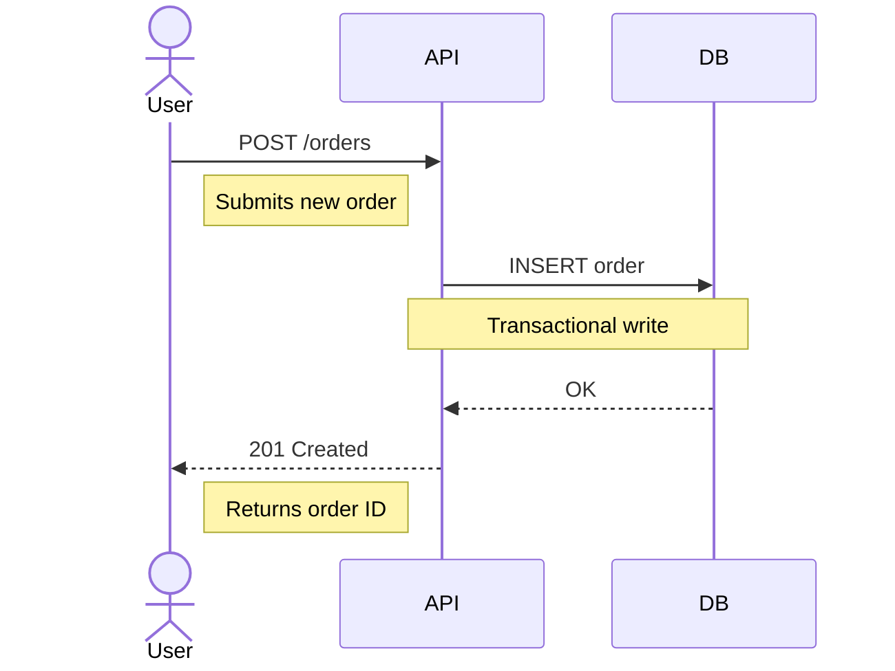
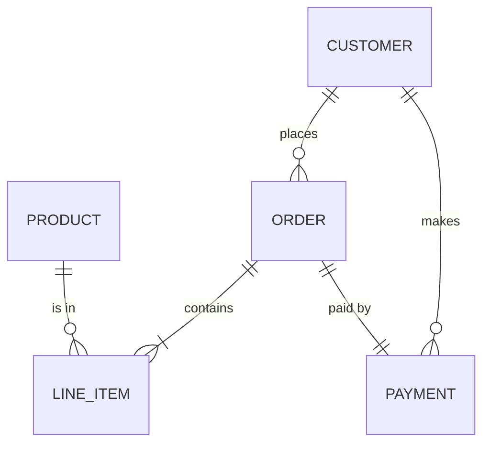
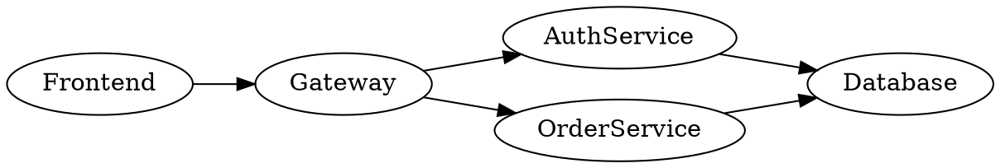
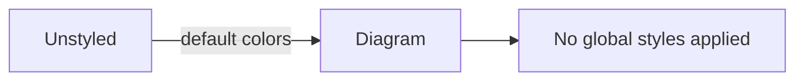

# Global Styles

This page demonstrates the `styles` configuration option, which applies a consistent corporate color scheme across all supported diagram types. The styles in this playground use an orange palette configured in `mkdocs.yml`:

```yaml
plugins:
  - kroki:
      styles:
        box:
          fill: "#fff3e0"
          stroke: "#e65100"
        actor:
          fill: "#ffe0b2"
          stroke: "#bf360c"
        note:
          fill: "#ffffcc"
          stroke: "#999900"
          color: "#666600"
        package:
          fill: "#fff3e0"
          stroke: "#e65100"
          color: "#bf360c"
        text:
          fill: "#333333"
          font-family: "Arial"
          font-size: "13"
        line:
          stroke: "#f57c00"
```

The `actor` element styles persons and actors separately from boxes. It maps to `skinparam Actor*` in PlantUML, `UpdateElementStyle("person", ...)` in C4, `actorBkg`/`actorBorder` in Mermaid, and `element "Person"` in Structurizr. When `actor` is not set, person elements fall back to `box` styles.

The `note` element styles note boxes in diagram types that support them. It maps to `skinparam Note*` in PlantUML/C4, and `noteBkgColor`/`noteBorderColor`/`noteTextColor` in Mermaid.

The `package` element styles package containers independently from regular boxes. It maps to `skinparam Package*` in PlantUML/C4, overriding the default `box` styles for package elements.

## PlantUML

Styles are injected as `skinparam` directives after `@startuml`.



### Packages

The `package` style overrides `box` defaults for package elements, allowing distinct container styling.



## C4 PlantUML

C4 diagrams use the same PlantUML handler.

```c4plantuml
!include <C4/C4_Context>

title Corporate System Landscape

Person(employee, "Employee", "Internal user")
System(portal, "Employee Portal", "Self-service HR and IT")
System_Ext(payroll, "Payroll Provider", "External payroll processing")

Rel(employee, portal, "Uses")
Rel(portal, payroll, "Sends payroll data to")
```

## Mermaid

Styles are injected as `%%{init: {themeVariables: ...}}%%`.



### Sequence Diagram with Notes

Notes in Mermaid sequence diagrams are styled via `noteBkgColor`, `noteBorderColor`, and `noteTextColor`.



### Entity Relationship

The `line.label-background` style sets `edgeLabelBackground` in Mermaid, giving relationship labels a matching background.



## GraphViz

Styles are injected as `node`, `edge`, and `graph` attributes.



## BlockDiag

Styles are injected as `default_node_color`, `default_textcolor`, etc.

```blockdiag
blockdiag {
  Client -> LoadBalancer -> AppServer -> Database;
  Client -> LoadBalancer -> CacheServer;
  AppServer -> CacheServer;
}
```

## Nomnoml

Styles are injected as `#fill`, `#stroke`, etc. directives.

```nomnoml
[Customer] -> [Order Service]
[Order Service] -> [Inventory]
[Order Service] -> [Payment Gateway]
[Payment Gateway] -> [Bank API]
```

## D2

Styles are injected as `**.style.*` glob directives and `(** -> **)[*].style.*` for connections.

```d2
Frontend -> API Gateway: REST
API Gateway -> Auth: Validate
API Gateway -> Orders: Process
Orders -> Database: Query
Auth -> Database: Lookup
```

## Structurizr

Styles are injected into the `views > styles` block using `element` and `relationship` selectors.

```structurizr
workspace {
  model {
    user = person "User"
    webapp = softwareSystem "Web App"
    db = softwareSystem "Database"
    user -> webapp "Uses"
    webapp -> db "Reads/Writes"
  }
  views {
    systemContext webapp {
      include *
      autolayout lr
    }
  }
}
```

## Unsupported Types

The following diagram types don't support source-level styling and render with their default colors: ERD, DBML, Ditaa, SVGBob, Pikchr, BPMN, Vega, VegaLite, WaveDrom, ByteField, Symbolator, WireViz, UMlet, Excalidraw. Use `no-style-inject=true` if you want to prevent any future injection attempts on these blocks.

## Opting Out

Use `no-style-inject=true` on a code block to skip style injection. This diagram uses its own colors instead of the global styles:


